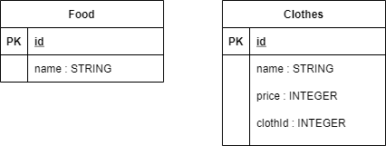

# api-server

## Notes:
- Implemented Express
- Implemented Jest
- Tested before deployment
- Connected Postgres
- Deployed on heroku

### Main Branch
https://omar-api-server.herokuapp.com
### Pull request
1. https://github.com/Omx302/api-server/pull/1
2. https://github.com/Omx302/api-server/pull/3
### Github actions
https://github.com/Omx302/api-server/actions/runs/1143675183
